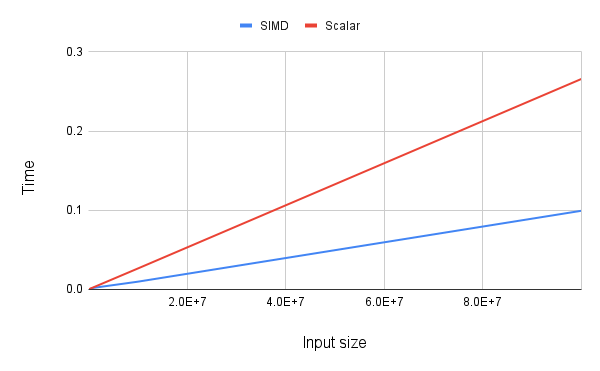

# Example of vector addition with normal scalar and SIMD with avx2

### Compile 

```bash 
gcc -mavx2 simd.c -o fuck_this_shit
```

### Run

```bash
./fuck_this_shit <array size>
```

## Comparison




